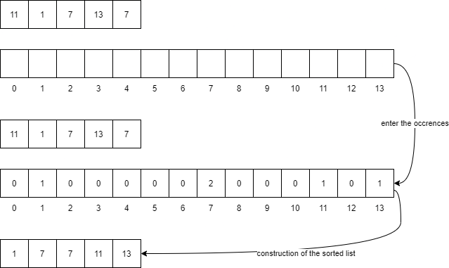

# sort_array.py

All algorithm to sort an array

Top sort algorithm : https://www.crio.do/blog/top-10-sorting-algorithms/

## Bubble sort

### Description

The bubble sort sorts by swapping the elements two by two, if the first element is bigger than the second, then they are swapped. This process is repeated until the list is definetly sorted.

### Example

### Complexity

    Worst Case: O(n^2)
    Average Case: O(n*logn)
    Best case: O(n*logn)

### Use cases

It is used to introduce the concept of a sorting algorithm. Bubble sorting is quite popular when it comes to detecting a very small error (like swap of just two elements) in almost-sorted arrays.

### Python3 implementation

## Selection sort

### Description

The selection sort goes through the list n times to find the minimum and put it in a new list. The new list will be in order.

### Example

### Complexity

    Worst Case: O(n^2)
    Average Case: O(n*logn)
    Best case: O(n*logn)

### Use cases

Selection sorting can be used for small lists and when storage space is limited. However I do not recommend using this sorting algorithm.

### Python3 implementation

## Insertion sort

### Description

The insertion sort goes through the whole list and places each element of the list in a new list at the right place.

### Example

### Complexity

    Worst Case: O(n^2)
    Average Case: O(n*logn)
    Best case: O(n*logn)

### Use cases

This algorithm can be used to sort small lists. However I do not recommend using this sorting algorithm.

### Python3 implementation

## Quick sort

### Description

Recursive algorithm that chooses a pivot from the list and places the elements according to the pivot (left < pivot, right > pivot). The recursion makes us go deeper and deeper into the list, until we sort just two elements. When finished, all elements are sorted.

To choose the pivot, I take the first value, the middle one and the last one of the list, then I take neither the max nor the min, to hope to have a value close to the median. Taking any pivot works too.

### Example

### Complexity

    Worst Case: O(n^2)
    Average Case: O(n*logn)
    Best case: O(n*logn)

### Use cases

Quicksort works for list sorting of any type of element. The sorting is done in the list itself, it does not require any additional storage.

## Merge sort

### Description

The sort merge recursively divides the list by two, then performs a backward chaining that merges by sorting the divided elements together.

### Example

### Complexity

    Worst Case: O(n*logn)
    Average Case: O(n*logn)
    Best case: O(n*logn)

### Use cases

Quicksort works for list sorting of any type of element. I recommend you to use this sorting algorithm if your data are varied (negative, positive, decimal...).

### Python3 implementation

## Counting sort

### Description

The count sort stores the number of occurrences of an element in a list whose index corresponds to the number of occurrences.

We can then create the sorted list thanks to the list of occurrences.

### Example

### Complexity

    Worst Case: O(n+k)

Where n is the size of input array and k is the count of unique elements in the array.

### Use cases

Counting sort is very effective for sorting small signed items. When it comes to large numbers, the hit list becomes huge and the algorithm loses its efficiency.

### Python3 implementation

## Radix sort

### Description

Radix sorting is a variant of counting sort, to stay close to a linear complexity with a large number list.

Indeed, we will use the counting sort, but only on each digit of the numbers in the list. To be clearer, we first sort by units, then by tens etc. The occurrence table will therefore only take 10 values [0,9] at each iteration.

### Example

### Complexity

### Use cases

### Python3 implementation

## Other sort

### Description

### Example

### Complexity

### Use cases

### Python3 implementation

# find_array.py

All algorithm to find an item in a int array
